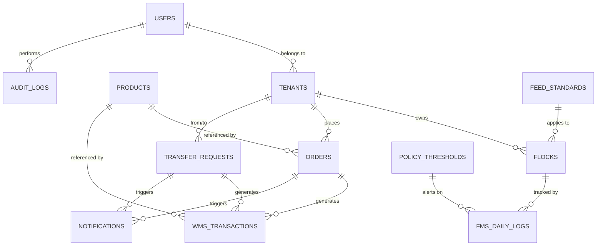
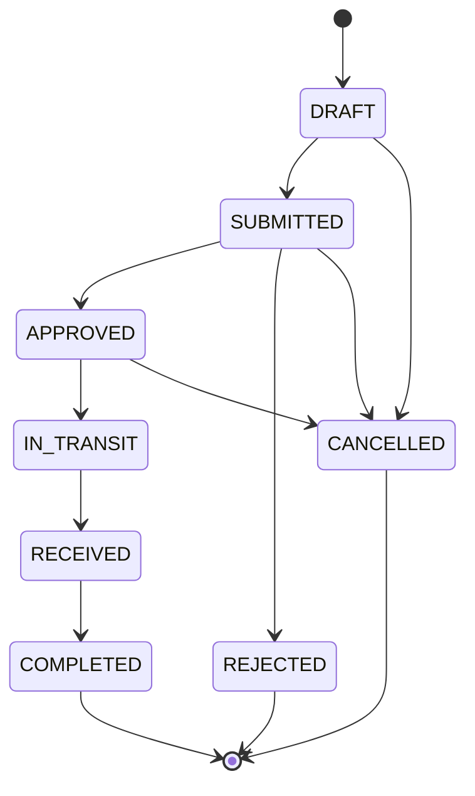

# Phase 02: Core Domain & Data Model

Phase 02 là input cho [Phase 03](./03-phase-transaction-and-workflow-hardening.md) và phải tuân thủ governance trong [Phase 01](./01-phase-foundation-and-governance.md) cùng master context tại [Phase 00](./00-master-context.md).

## 1. Mục tiêu

- Hoàn thiện model dữ liệu cho các domain cốt lõi: tenant, flock, feed, order, WMS, transfer, audit và notification.
- Định nghĩa lifecycle rõ ràng cho từng domain.
- Đảm bảo relationship nhất quán với Payload collections.
- Chuẩn bị nền tảng cho transaction safety, idempotency và workflow hardening ở Phase 03.

## 2. Domain chính

### 2.1. Tenant & Ownership

- Tenant là đơn vị sở hữu hoặc điều hành tài nguyên và order.
- Tenant ràng buộc với origin/destination và inventory scope.
- Các relationship nghiệp vụ dùng Payload `relationship`, không dùng raw text ID thay thế.

### 2.2. Flock & Production

- Flock gắn với đàn gà, lịch trình và activity history.
- Flock được dùng trong quyết định tiêu thụ, transfer và báo cáo WMS.

### 2.3. Feed & Policy

- Feed Standards định chuẩn thức ăn theo product và production stage.
- Policy Thresholds quy định alert/threshold business rules cho FMS.

### 2.4. Orders & WMS

- Orders chứa lifecycle, tenant, location, product, quantity và delivery dates.
- WmsTransactions là inventory ledger append-only, không update/delete.

### 2.5. Transfer & Notifications

- TransferRequests quản lý workflow phê duyệt, vận chuyển, nhận hàng và hoàn tất.
- Notifications và Audit Logs tạo traceability theo trạng thái và actor.

## 3. ERD Diagram



## 4. State Machine Diagrams

### 4.1. Order Status



### 4.2. Transfer Status


## 5. Field Contract cho 12 collections

### 5.1. users

| Field              | Type         | Required | ReadOnly | Unique | Ghi chú               |
| ------------------ | ------------ | -------- | -------- | ------ | --------------------- |
| email              | email        | ✅       | ❌       | ✅     | Login                 |
| role               | select       | ✅       | ❌       | ❌     | ADMIN, OPERATOR, FARM |
| fullName           | text         | ✅       | ❌       | ❌     | —                     |
| phone              | text         | ❌       | ❌       | ❌     | —                     |
| accountStatus      | select       | ✅       | ❌       | ❌     | ACTIVE, LOCKED        |
| tenantMemberships  | array        | ❌       | ❌       | ❌     | relationTo: tenants   |
| primaryTenant      | relationship | ❌       | ❌       | ❌     | relationTo: tenants   |
| authzVersion       | text         | ✅       | ✅       | ❌     | System-managed        |
| mustChangePassword | checkbox     | ✅       | ❌       | ❌     | Default false         |
| password           | password     | ✅       | ✅       | ❌     | Auto by Payload       |
| hash               | text         | ✅       | ✅       | ❌     | Auto by Payload       |
| salt               | text         | ✅       | ✅       | ❌     | Auto by Payload       |
| createdBy          | relationship | ❌       | ✅       | ❌     | relationTo: users     |

### 5.2. tenants

| Field      | Type   | Required | ReadOnly | Unique | Ghi chú        |
| ---------- | ------ | -------- | -------- | ------ | -------------- |
| tenantId   | text   | ✅       | ✅       | ✅     | Auto-gen       |
| name       | text   | ✅       | ❌       | ❌     | —              |
| tenantType | select | ✅       | ❌       | ❌     | FARM, FACTORY  |
| status     | select | ✅       | ❌       | ❌     | ACTIVE, LOCKED |
| metadata   | json   | ❌       | ❌       | ❌     | Extensible     |

### 5.3. flocks

| Field        | Type         | Required | ReadOnly | Unique | Ghi chú                    |
| ------------ | ------------ | -------- | -------- | ------ | -------------------------- |
| flockId      | text         | ✅       | ✅       | ✅     | Auto-gen                   |
| tenant       | relationship | ✅       | ❌       | ❌     | relationTo: tenants        |
| name         | text         | ✅       | ❌       | ❌     | —                          |
| startDate    | date         | ✅       | ❌       | ❌     | —                          |
| status       | select       | ✅       | ❌       | ❌     | ACTIVE, CLOSED             |
| feedStandard | relationship | ❌       | ❌       | ❌     | relationTo: feed-standards |

### 5.4. products

| Field    | Type   | Required | ReadOnly | Unique | Ghi chú                   |
| -------- | ------ | -------- | -------- | ------ | ------------------------- |
| sku      | text   | ✅       | ✅       | ✅     | Unique                    |
| name     | text   | ✅       | ❌       | ❌     | —                         |
| uom      | select | ✅       | ❌       | ❌     | KG, TON, UNIT             |
| category | select | ❌       | ❌       | ❌     | FEED, MEDICINE, EQUIPMENT |

### 5.5. feed-standards

| Field          | Type         | Required | ReadOnly | Unique | Ghi chú                   |
| -------------- | ------------ | -------- | -------- | ------ | ------------------------- |
| standardId     | text         | ✅       | ✅       | ✅     | Auto-gen                  |
| product        | relationship | ✅       | ❌       | ❌     | relationTo: products      |
| stage          | select       | ✅       | ❌       | ❌     | STARTER, GROWER, FINISHER |
| quantityPerDay | number       | ✅       | ❌       | ❌     | > 0                       |
| unit           | select       | ✅       | ❌       | ❌     | KG, GRAM                  |

### 5.6. policy-thresholds

| Field       | Type   | Required | ReadOnly | Unique | Ghi chú                             |
| ----------- | ------ | -------- | -------- | ------ | ----------------------------------- |
| thresholdId | text   | ✅       | ✅       | ✅     | Auto-gen                            |
| metric      | select | ✅       | ❌       | ❌     | FEED_CONSUMPTION, MORTALITY, WEIGHT |
| minValue    | number | ❌       | ❌       | ❌     | —                                   |
| maxValue    | number | ❌       | ❌       | ❌     | —                                   |
| severity    | select | ✅       | ❌       | ❌     | WARNING, CRITICAL                   |

### 5.7. orders

| Field                | Type         | Required | ReadOnly | Unique | Ghi chú              |
| -------------------- | ------------ | -------- | -------- | ------ | -------------------- |
| orderId              | text         | ✅       | ✅       | ✅     | Auto-gen ORD-xxx     |
| status               | select       | ✅       | ❌       | ❌     | Finite state machine |
| tenant               | relationship | ✅       | ❌       | ❌     | relationTo: tenants  |
| client               | text         | ❌       | ❌       | ❌     | —                    |
| origin               | text         | ✅       | ❌       | ❌     | —                    |
| destination          | text         | ✅       | ❌       | ❌     | —                    |
| product              | relationship | ✅       | ❌       | ❌     | relationTo: products |
| quantity             | number       | ✅       | ❌       | ❌     | > 0                  |
| uom                  | select       | ✅       | ❌       | ❌     | KG, TON, UNIT        |
| pickupDate           | date         | ❌       | ❌       | ❌     | —                    |
| expectedDeliveryDate | date         | ❌       | ❌       | ❌     | —                    |
| actualDeliveryDate   | date         | ❌       | ❌       | ❌     | —                    |
| flock                | relationship | ❌       | ❌       | ❌     | relationTo: flocks   |
| note                 | textarea     | ❌       | ❌       | ❌     | —                    |

### 5.8. wms-transactions

| Field         | Type         | Required | ReadOnly | Unique | Ghi chú                                              |
| ------------- | ------------ | -------- | -------- | ------ | ---------------------------------------------------- |
| scope         | select       | ✅       | ✅       | ❌     | TENANT, FARM                                         |
| tenant        | relationship | ✅       | ✅       | ❌     | relationTo: tenants                                  |
| flock         | relationship | ❌       | ✅       | ❌     | Required if scope=FARM                               |
| product       | relationship | ✅       | ✅       | ❌     | relationTo: products                                 |
| txnType       | select       | ✅       | ✅       | ❌     | INBOUND, OUTBOUND, LOSS, ADJUSTMENT, REPORT, CONSUME |
| quantity      | number       | ✅       | ✅       | ❌     | > 0                                                  |
| order         | relationship | ❌       | ✅       | ❌     | relationTo: orders                                   |
| reason        | text         | ❌       | ✅       | ❌     | Required for ADJUSTMENT/LOSS                         |
| date          | date         | ✅       | ✅       | ❌     | —                                                    |
| note          | textarea     | ❌       | ✅       | ❌     | —                                                    |
| beginQuantity | number       | ❌       | ✅       | ❌     | Calculated                                           |
| inQuantity    | number       | ❌       | ✅       | ❌     | Calculated                                           |
| outQuantity   | number       | ❌       | ✅       | ❌     | Calculated                                           |
| endQuantity   | number       | ❌       | ✅       | ❌     | Calculated                                           |

Append-only: `update/delete = deny` theo access matrix Phase 01.

### 5.9. fms-daily-logs

| Field        | Type         | Required | ReadOnly | Unique | Ghi chú            |
| ------------ | ------------ | -------- | -------- | ------ | ------------------ |
| logId        | text         | ✅       | ✅       | ✅     | Auto-gen           |
| flock        | relationship | ✅       | ❌       | ❌     | relationTo: flocks |
| date         | date         | ✅       | ❌       | ❌     | —                  |
| feedConsumed | number       | ❌       | ❌       | ❌     | —                  |
| mortality    | number       | ❌       | ❌       | ❌     | —                  |
| avgWeight    | number       | ❌       | ❌       | ❌     | —                  |
| note         | textarea     | ❌       | ❌       | ❌     | —                  |

### 5.10. transfer-requests

| Field       | Type         | Required | ReadOnly | Unique | Ghi chú              |
| ----------- | ------------ | -------- | -------- | ------ | -------------------- |
| transferId  | text         | ✅       | ✅       | ✅     | Auto-gen TRF-xxx     |
| status      | select       | ✅       | ❌       | ❌     | Finite state machine |
| fromTenant  | relationship | ✅       | ❌       | ❌     | relationTo: tenants  |
| toTenant    | relationship | ✅       | ❌       | ❌     | relationTo: tenants  |
| product     | relationship | ✅       | ❌       | ❌     | relationTo: products |
| quantity    | number       | ✅       | ❌       | ❌     | > 0                  |
| flock       | relationship | ❌       | ❌       | ❌     | relationTo: flocks   |
| requestedBy | relationship | ✅       | ❌       | ❌     | relationTo: users    |
| approvedBy  | relationship | ❌       | ❌       | ❌     | relationTo: users    |
| receivedBy  | relationship | ❌       | ❌       | ❌     | relationTo: users    |
| note        | textarea     | ❌       | ❌       | ❌     | —                    |

### 5.11. notifications

| Field            | Type         | Required | ReadOnly | Unique | Ghi chú                    |
| ---------------- | ------------ | -------- | -------- | ------ | -------------------------- |
| title            | text         | ✅       | ✅       | ❌     | —                          |
| content          | textarea     | ✅       | ✅       | ❌     | —                          |
| targetCollection | text         | ✅       | ✅       | ❌     | orders / transfer-requests |
| targetId         | text         | ✅       | ✅       | ❌     | —                          |
| readAt           | date         | ❌       | ❌       | ❌     | Null if unread             |
| targetUser       | relationship | ❌       | ✅       | ❌     | relationTo: users          |

Append-only theo business event; create bởi system và read bởi admin. `readAt` là ngoại lệ nếu cần đánh dấu đã đọc theo policy.

### 5.12. audit-logs

| Field            | Type         | Required | ReadOnly | Unique | Ghi chú                       |
| ---------------- | ------------ | -------- | -------- | ------ | ----------------------------- |
| actorUserId      | relationship | ✅       | ✅       | ❌     | relationTo: users             |
| actorEmail       | email        | ✅       | ✅       | ❌     | Snapshot                      |
| actorRole        | select       | ✅       | ✅       | ❌     | ADMIN, OPERATOR, FARM, SYSTEM |
| action           | text         | ✅       | ✅       | ❌     | e.g. APPROVE_ORDER            |
| targetCollection | text         | ✅       | ✅       | ❌     | —                             |
| targetId         | text         | ✅       | ✅       | ❌     | —                             |
| before           | json         | ❌       | ✅       | ❌     | Snapshot trước                |
| after            | json         | ❌       | ✅       | ❌     | Snapshot sau                  |
| timestamp        | date         | ✅       | ✅       | ❌     | Auto                          |

Append-only: create bởi system và read bởi admin.

## Field Mapping — Production vs Canonical

| Canonical (doc) | Production (code) | Collection     |
| --------------- | ----------------- | -------------- |
| `tenantType`    | `type`            | tenants        |
| `category`      | `productType`     | products       |
| `content`       | `message`         | notifications  |
| `targetUser`    | `recipient`       | notifications  |
| `feedConsumed`  | `feedQtyAct`      | fms-daily-logs |
| `mortality`     | `mortAct`         | fms-daily-logs |
| `avgWeight`     | `endQty`          | fms-daily-logs |

Mapping được thực thi tại:

- [src/domains/shared/field-mapping.ts](../../src/domains/shared/field-mapping.ts)
- [src/domains/tenants/mapper.ts](../../src/domains/tenants/mapper.ts)
- [src/domains/products/mapper.ts](../../src/domains/products/mapper.ts)
- [src/domains/notifications/mapper.ts](../../src/domains/notifications/mapper.ts)
- [src/domains/fms/mapper.ts](../../src/domains/fms/mapper.ts)

## 6. State Machine Types (code)

```ts
export type OrderStatus =
  | "DRAFT"
  | "SUBMITTED"
  | "APPROVED"
  | "REJECTED"
  | "IN_TRANSIT"
  | "RECEIVED"
  | "COMPLETED"
  | "CANCELLED";

export type TransferStatus = OrderStatus;

export const ORDER_TRANSITIONS: Record<OrderStatus, OrderStatus[]> = {
  DRAFT: ["SUBMITTED", "CANCELLED"],
  SUBMITTED: ["APPROVED", "REJECTED", "CANCELLED"],
  APPROVED: ["IN_TRANSIT", "CANCELLED"],
  IN_TRANSIT: ["RECEIVED"],
  RECEIVED: ["COMPLETED"],
  COMPLETED: [],
  REJECTED: [],
  CANCELLED: [],
};

export function assertOrderTransition(from: OrderStatus, to: OrderStatus) {
  if (!ORDER_TRANSITIONS[from].includes(to)) {
    throw new Error(`Invalid order transition: ${from} -> ${to}`);
  }
}

export const TRANSFER_TRANSITIONS: Record<TransferStatus, TransferStatus[]> = {
  ...ORDER_TRANSITIONS,
};

export function assertTransferTransition(
  from: TransferStatus,
  to: TransferStatus,
) {
  if (!TRANSFER_TRANSITIONS[from].includes(to)) {
    throw new Error(`Invalid transfer transition: ${from} -> ${to}`);
  }
}
```

## 7. Append-only Enforcement (code)

```ts
import type { CollectionConfig } from "payload";
import { adminOnly, denyAll } from "@/access/admin-only";

export const WmsTransactions: CollectionConfig = {
  slug: "wms-transactions",
  access: {
    create: adminOnly,
    read: adminOnly,
    update: denyAll,
    delete: denyAll,
  },
  fields: [
    // ... per field contract
  ],
};

export const AuditLogs: CollectionConfig = {
  slug: "audit-logs",
  access: {
    create: () => true,
    read: adminOnly,
    update: denyAll,
    delete: denyAll,
  },
  fields: [
    // ... per field contract
  ],
};
```

## 8. Checklist triển khai

- [ ] Mỗi collection có schema rõ required/optional.
- [ ] Relationship dùng đúng `relationTo`, không dùng text raw ID.
- [ ] `migrationKey`, `unique` và `readOnly` dùng đúng mục đích.
- [ ] `status` được model thành finite state machine.
- [ ] `wms-transactions` giữ tính append-only.
- [ ] `audit-logs` là source-of-truth cho accountability.
- [ ] Generated ID (`orderId`, `transferId`, `flockId`, `tenantId`) có prefix rõ ràng.

## 9. Rủi ro nếu không làm Phase 02

- Status state machine bị lệch giữa UI và Data Layer.
- Inventory ledger không còn là nguồn sự thật.
- Không có đường trace khi đối chiếu order vs transfer vs WMS.
- Field type không thống nhất gây lỗi khi query hoặc migration.

## 10. Acceptance Criteria

- [ ] Mỗi domain có mapping rõ giữa UI, collection và business process.
- [ ] Orders, Transfer Requests, WMS Transactions không còn mơ hồ về lifecycle.
- [ ] Inventory ledger là append-only, không thể làm sai lệch bằng update/delete.
- [ ] Audit log có thể chứng minh ai đã thao tác và khi nào.
- [ ] Tất cả relationship chính đều dùng Payload relationship, không phụ thuộc text ID.
- [ ] State machine types export được và dùng chung giữa hooks/services.

## 11. Rollback Plan

- Nếu model mới làm nặng quá, rollback về model dữ liệu đã chứng minh trong repo hiện tại; chỉ mở rộng field/relation theo domain đã xác nhận.
- Nếu state machine quá chặt, tạm freeze transition validation và cho phép manual approval với audit log rõ ràng.
- Nếu ledger bị sai, tạm dừng tất cả write path tạo WMS entry mới và giữ existing data read-only để điều tra.

## 12. Liên kết phase

- Phase trước: [01-phase-foundation-and-governance.md](./01-phase-foundation-and-governance.md)
- Phase tiếp theo: [03-phase-transaction-and-workflow-hardening.md](./03-phase-transaction-and-workflow-hardening.md)
- Cross-cutting concerns:
  - Transaction safety: Phase 03, dựa trên state machine định nghĩa ở Phase 02
  - Idempotency: Phase 03
  - Append-only enforcement: Phase 02 + 03
